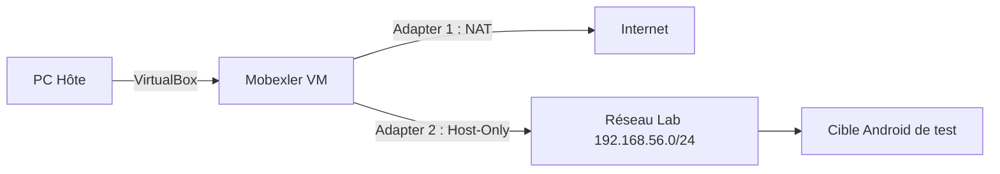
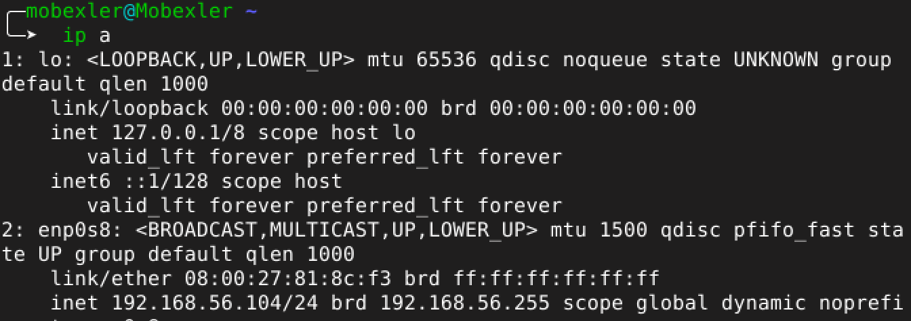
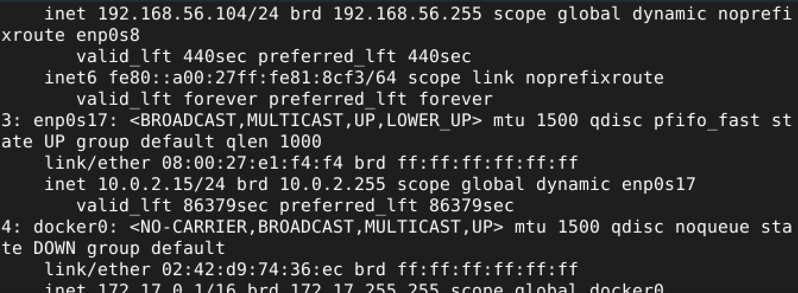
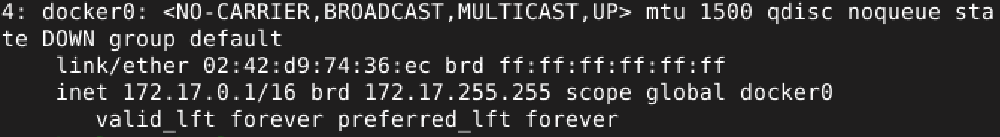

<div align="center">

# 📱 Mobexler Lab Setup — LAB 1

### Mise en place d’un environnement propre pour les tests de sécurité mobile  
**Mobexler + VirtualBox + NAT + Host-Only + ADB + Snapshot CLEAN**

<br>


</div>

---

## ✨ Aperçu du laboratoire

Ce laboratoire consiste à préparer un environnement de sécurité mobile basé sur **Mobexler**, une machine virtuelle orientée pentest mobile.  
L’objectif principal est de disposer d’une VM stable, connectée à Internet via **NAT**, reliée à un réseau privé de laboratoire via **Host-Only**, et sauvegardée dans un état propre grâce à un snapshot.

<div align="center">


</div>

---

## 🎯 Objectifs pédagogiques

À la fin de ce LAB, l’environnement doit permettre de :

| Objectif | Description |
|---|---|
| 🚀 Démarrage Mobexler | Lancer la VM sans erreur |
| 🌐 Accès Internet | Utiliser le NAT pour accéder au Web |
| 🧪 Réseau de laboratoire | Utiliser Host-Only pour communiquer avec une cible Android |
| 🔌 ADB | Vérifier la disponibilité d’Android Debug Bridge |
| 🧼 Snapshot CLEAN | Créer un état restaurable propre pour les prochains TPs |

---

## 🧰 Outils utilisés

<div align="center">

| Outil | Rôle |
|---|---|
| **VirtualBox** | Importation et exécution de la VM |
| **Mobexler OVA** | Environnement de sécurité mobile |
| **PowerShell** | Calcul du hash SHA256 |
| **Terminal Linux** | Vérification réseau et ADB |
| **Firefox** | Test de navigation Internet |
| **ADB** | Communication future avec une cible Android |

</div>

---

## 🗂️ Structure du dossier

```text
LAB1_Mobexler/
│
├── README.md
│
└── screenshots/
    ├── Mobexler_VM.png
    ├── import_VM.png
    ├── mobexler_import.png
    ├── NAT_adapter.png
    ├── Host-Only_adapter.png
    ├── hash_pshell.png
    ├── online_hash.png
    ├── Mobexler_on.png
    ├── Mobexler_in.png
    ├── ip_status.png
    ├── iproute.png
    ├── ping888.png
    ├── pinggoogle.png
    ├── firefox_internet_OK.png
    ├── adbversion.png
    ├── adbdevices.png
    └── snapshot_creation.png
```

> 💡 Les noms des images doivent correspondre exactement aux noms utilisés dans ce README.

---

# 🧩 Étape 1 — Téléchargement de Mobexler

L’image Mobexler a été téléchargée au format **OVA** depuis le lien fourni dans la plateforme du professeur.

Ce fichier représente une machine virtuelle prête à être importée dans VirtualBox.

<div align="center">


</div>

---

# 🔐 Étape 2 — Vérification du hash SHA256

Pour garantir que le fichier téléchargé n’est pas corrompu, un hash **SHA256** a été calculé avec PowerShell.

```powershell
Get-FileHash .\Mobexler.ova -Algorithm SHA256
```

Cette étape permet de tracer le téléchargement et de vérifier l’intégrité de l’image OVA.

<div align="center">

<table>
<tr>
<td align="center" width="50%">
<br>
<b>Hash calculé avec PowerShell</b>
</td>
<td align="center" width="50%">
<br>
<b>Vérification du hash</b>
</td>
</tr>
</table>

</div>

---

# 📦 Étape 3 — Importation de la VM dans VirtualBox

L’image OVA a été importée dans VirtualBox via :

```text
File → Import Appliance
```

ou en français :

```text
Fichier → Importer un appareil virtuel
```

Après l’importation, la VM Mobexler apparaît correctement dans la liste des machines virtuelles.

<div align="center">

<table>
<tr>
<td align="center" width="50%">
<br>
<b>Importation de l’OVA</b>
</td>
<td align="center" width="50%">
<br>
<b>VM Mobexler importée</b>
</td>
</tr>
</table>

</div>

---

# 🌐 Étape 4 — Configuration réseau

La VM a été configurée avec deux cartes réseau complémentaires :

```text
Adapter 1 : NAT
Adapter 2 : Host-Only Adapter
```

## 🟢 Adapter 1 — NAT

Le mode **NAT** permet à Mobexler d’utiliser la connexion Internet de la machine hôte.

```text
Attached to : NAT
Cable Connected : Enabled
```

<div align="center">


</div>

## 🔵 Adapter 2 — Host-Only

Le mode **Host-Only** crée un réseau privé entre la machine hôte, Mobexler et les futures cibles Android de test.

```text
Attached to : Host-Only Adapter
Cable Connected : Enabled
```

<div align="center">


</div>

---

## 🧭 Schéma logique du réseau



---

# 🖥️ Étape 5 — Premier démarrage de Mobexler

Après l’importation et la configuration réseau, Mobexler a été démarré avec succès.

<div align="center">

<table>
<tr>
<td align="center" width="50%">
<br>
<b>Démarrage de Mobexler</b>
</td>
<td align="center" width="50%">
<br>
<b>Accès au bureau</b>
</td>
</tr>
</table>

</div>

---

# 📡 Étape 6 — Vérification des interfaces réseau

Les interfaces réseau ont été vérifiées avec :

```bash
ip a
```

et avec une version plus lisible :

```bash
ip -br a
```

Résultat important observé :

```text
enp0s8    UP    192.168.56.104/24
```

Cette adresse confirme que l’interface **Host-Only** fonctionne correctement.

<div align="center">


</div>

## 📸 Détails des interfaces

<div align="center">

<table>
<tr>
<td align="center" width="33%">
<br>
<b>Interface Host-Only</b>
</td>
<td align="center" width="33%">
<br>
<b>Détails IP</b>
</td>
<td align="center" width="33%">
<br>
<b>Docker et interfaces</b>
</td>
</tr>
</table>

</div>

> ⚠️ Dans mon dossier, les captures `ipa 1`, `ipa 2` et `ipa 3` peuvent être renommées en `ipa_1.png`, `ipa_2.png` et `ipa_3.png` pour éviter les problèmes d’affichage sur GitHub.

---

# 🛣️ Étape 7 — Vérification de la route réseau

La route réseau a été vérifiée avec :

```bash
ip route
```

Cette commande permet de confirmer les réseaux connus par Mobexler et la route utilisée pour la communication réseau.

<div align="center">


</div>

---

# ✅ Étape 8 — Test de connectivité Internet

Deux tests ont été réalisés :

## Test vers une adresse IP publique

```bash
ping -c 2 8.8.8.8
```

Résultat :

```text
2 packets transmitted, 2 received, 0% packet loss
```

<div align="center">


</div>

## Test DNS avec Google

```bash
ping -c 2 google.com
```

Résultat :

```text
2 packets transmitted, 2 received, 0% packet loss
```

<div align="center">


</div>

---

# 🔎 Étape 9 — Test Internet avec Firefox

L’accès Internet a aussi été testé depuis Firefox dans la VM.

La page Google s’ouvre correctement, ce qui confirme que la navigation Web fonctionne.

<div align="center">


</div>

---

# 🔌 Étape 10 — Vérification d’ADB

ADB a été vérifié avec :

```bash
adb version
```

Résultat obtenu :

```text
Android Debug Bridge version 1.0.39
```

<div align="center">


</div>

Ensuite, la liste des appareils Android connectés a été vérifiée :

```bash
adb devices
```

Aucun appareil Android n’était encore connecté, ce qui est normal pour ce premier laboratoire.

<div align="center">


</div>

---

# 🧼 Étape 11 — Création du snapshot CLEAN

Après validation de l’environnement, un snapshot propre a été créé.

```text
Nom : CLEAN_BASELINE_TP1
```

Description :

```text
Import OK, NAT + Host-Only OK, Internet OK, DNS OK, ADB prêt.
```

Ce snapshot permet de revenir à un état stable avant les prochains travaux pratiques.

<div align="center">


</div>

---

# 📊 Tableau récapitulatif

| Vérification | Résultat |
|---|---|
| 📦 Fichier OVA téléchargé | ✅ Validé |
| 🔐 Hash SHA256 calculé | ✅ Validé |
| 🖥️ VM importée dans VirtualBox | ✅ Validé |
| 🌐 Adapter NAT configuré | ✅ Validé |
| 🔵 Adapter Host-Only configuré | ✅ Validé |
| 🚀 Mobexler démarre correctement | ✅ Validé |
| 📡 Interface Host-Only en `192.168.56.104/24` | ✅ Validé |
| 🛣️ Route réseau vérifiée | ✅ Validé |
| ✅ Ping `8.8.8.8` | ✅ Validé |
| ✅ Ping `google.com` | ✅ Validé |
| 🔎 Firefox Internet OK | ✅ Validé |
| 🔌 ADB disponible | ✅ Validé |
| 🧼 Snapshot `CLEAN_BASELINE_TP1` créé | ✅ Validé |

---

# 📝 Conclusion

L’environnement **Mobexler** est maintenant prêt pour les prochains laboratoires de sécurité mobile.

La machine virtuelle dispose :

- d’un accès Internet via **NAT** ;
- d’un réseau privé **Host-Only** pour les futures communications avec une cible Android ;
- d’**ADB** pour les manipulations Android ;
- d’un snapshot propre nommé **CLEAN_BASELINE_TP1**.

Ce snapshot servira de point de restauration propre avant toute modification avancée comme l’installation de certificats, la configuration de proxy ou les tests sur applications Android.

---

<div align="center">

### ✅ LAB 1 terminé avec succès

**Mobexler est prêt pour les prochains TPs de sécurité mobile.**

</div>
