# Mobexler Lab Setup – LAB 1

Mise en place d’un environnement de laboratoire mobile basé sur **Mobexler**, avec une configuration réseau propre, un accès Internet via **NAT**, un réseau privé **Host-Only**, une vérification d’ADB et la création d’un snapshot propre pour les prochains travaux pratiques.

---

## Objectif du laboratoire

Ce laboratoire a pour objectif de préparer un environnement stable pour les prochains travaux pratiques de sécurité mobile.

À la fin du LAB 1, l’environnement doit permettre de :

- Démarrer correctement la machine virtuelle **Mobexler**.
- Accéder à Internet depuis Mobexler grâce à l’interface **NAT**.
- Communiquer avec une cible Android de test via un réseau **Host-Only**.
- Vérifier la disponibilité de l’outil **ADB**.
- Créer un snapshot propre nommé **CLEAN_BASELINE_TP1** afin de restaurer l’environnement en cas de problème.

---

## Outils utilisés

- **VirtualBox**
- **Mobexler OVA**
- **PowerShell**
- **Terminal Linux**
- **Firefox**
- **ADB – Android Debug Bridge**

---

## Arborescence des captures

Les captures du laboratoire sont placées dans le dossier :

```text
screenshots/
```

Exemple d’organisation :

```text
LAB1_Mobexler/
├── README.md
└── screenshots/
    ├── Mobexler_VM.png
    ├── import_VM.png
    ├── NAT_adapter.png
    ├── Host-Only_adapter.png
    ├── hash_pshell.png
    ├── online_hash.png
    ├── Mobexler_on.png
    ├── ip_status.png
    ├── iproute.png
    ├── ping888.png
    ├── pinggoogle.png
    ├── firefox_internet_OK.png
    ├── adbversion.png
    ├── adbdevices.png
    └── snapshot_creation.png
```

---

## 1. Téléchargement de l’image Mobexler

L’image de la machine virtuelle Mobexler a été téléchargée au format **OVA** depuis le lien fourni dans la plateforme du professeur.

Après téléchargement, le fichier OVA est placé dans le dossier du laboratoire afin de garder une trace claire du setup.

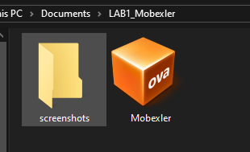

---

## 2. Vérification de l’intégrité du fichier

Pour vérifier l’intégrité du fichier téléchargé, un hash **SHA256** a été calculé avec PowerShell.

Commande utilisée :

```powershell
Get-FileHash .\Mobexler.ova -Algorithm SHA256
```

Cette étape permet de vérifier que le fichier n’est pas corrompu après le téléchargement.

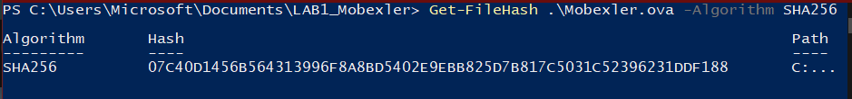

Une vérification du hash en ligne a également été effectuée afin de garder une preuve supplémentaire dans le dossier du laboratoire.

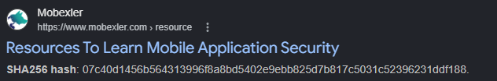

---

## 3. Importation de la machine virtuelle

La machine virtuelle a été importée dans **VirtualBox** à partir du fichier OVA.

Chemin utilisé dans VirtualBox :

```text
File → Import Appliance
```

ou en français :

```text
Fichier → Importer un appareil virtuel
```

Après l’importation, la VM Mobexler apparaît correctement dans VirtualBox.

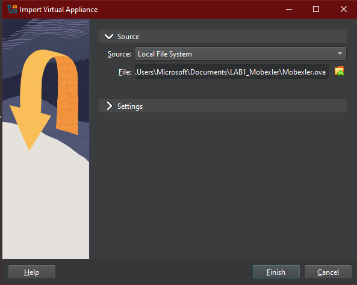


---

## 4. Configuration réseau

La machine virtuelle Mobexler a été configurée avec deux cartes réseau.

### Adapter 1 : NAT

L’interface **NAT** permet à Mobexler d’accéder à Internet à travers la connexion de la machine hôte.

Configuration :

```text
Adapter 1 : NAT
Cable Connected : Enabled
```

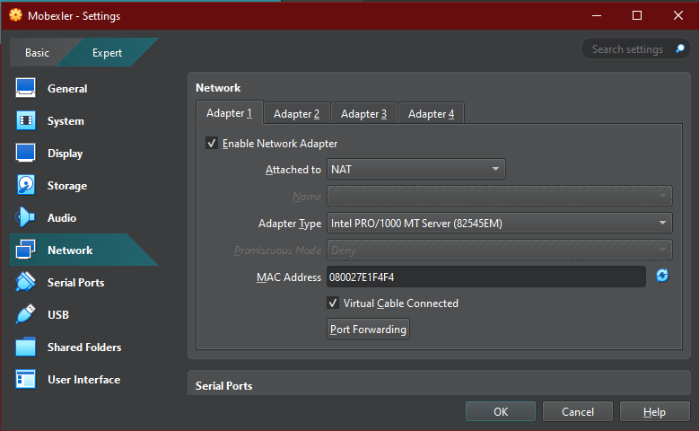

### Adapter 2 : Host-Only

L’interface **Host-Only** permet de créer un réseau privé entre la machine hôte, Mobexler et une future cible Android de test.

Configuration :

```text
Adapter 2 : Host-Only Adapter
Cable Connected : Enabled
```

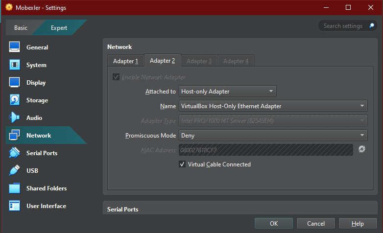

---

## 5. Premier démarrage de Mobexler

Après l’importation et la configuration réseau, la machine virtuelle Mobexler a été démarrée.

L’environnement graphique s’est lancé correctement.

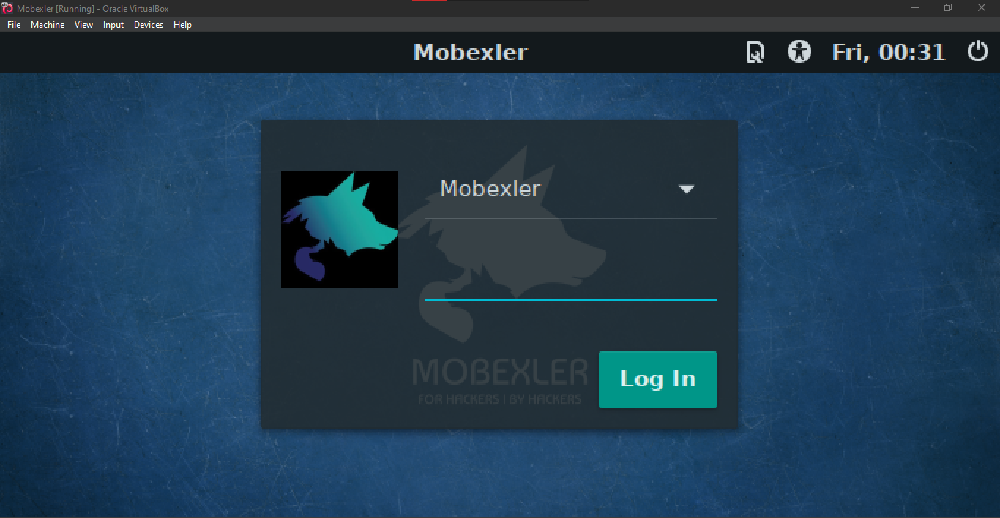

Après connexion, le bureau Mobexler est accessible.

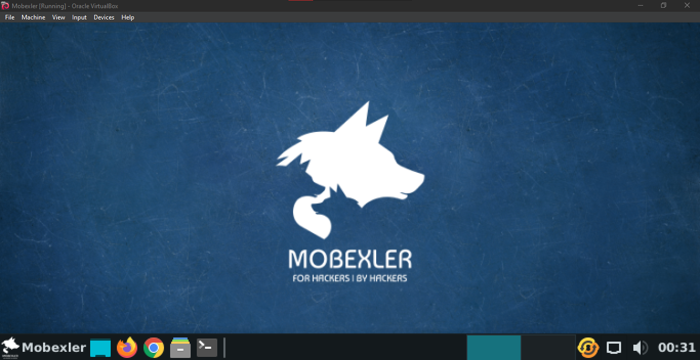

---

## 6. Vérification des interfaces réseau

La commande suivante a été utilisée pour afficher les interfaces réseau :

```bash
ip a
```

Une version plus lisible a également été utilisée :

```bash
ip -br a
```

Les interfaces principales observées sont :

```text
enp0s17 : interface NAT
enp0s8  : interface Host-Only
docker0 : interface interne Docker
```

L’interface Host-Only a reçu l’adresse suivante :

```text
192.168.56.104/24
```

Cela confirme que la communication sur le réseau privé de laboratoire est fonctionnelle.

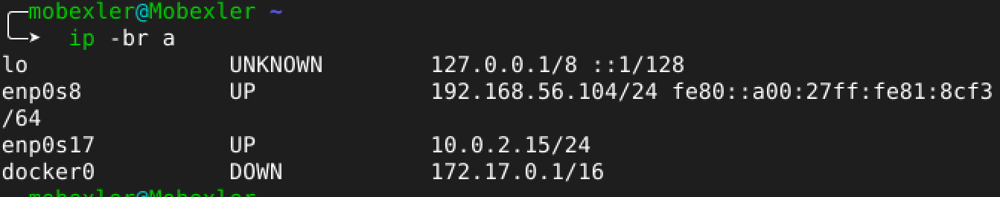


---

## 7. Vérification de la route réseau

La route réseau a été vérifiée avec la commande :

```bash
ip route
```

Cette commande permet d’identifier la route par défaut utilisée par Mobexler pour accéder à Internet.

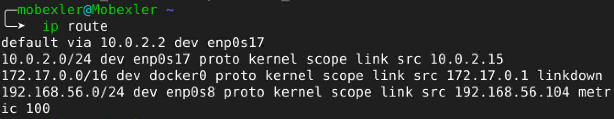

---

## 8. Test de connectivité Internet

La connectivité Internet a été testée en deux étapes.

### Test vers une adresse IP publique

Commande utilisée :

```bash
ping -c 2 8.8.8.8
```

Résultat obtenu :

```text
2 packets transmitted, 2 received, 0% packet loss
```

Cela confirme que la connectivité IP fonctionne.


### Test DNS avec Google

Commande utilisée :

```bash
ping -c 2 google.com
```

Résultat obtenu :

```text
2 packets transmitted, 2 received, 0% packet loss
```

Cela confirme que la résolution DNS fonctionne également.

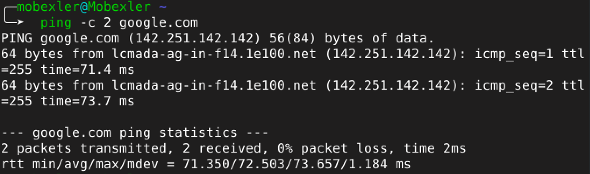

---

## 9. Test Internet avec Firefox

L’accès Web a été testé depuis Firefox à l’intérieur de la VM Mobexler.

La page Google s’ouvre correctement, ce qui confirme que l’accès Internet fonctionne aussi depuis le navigateur.

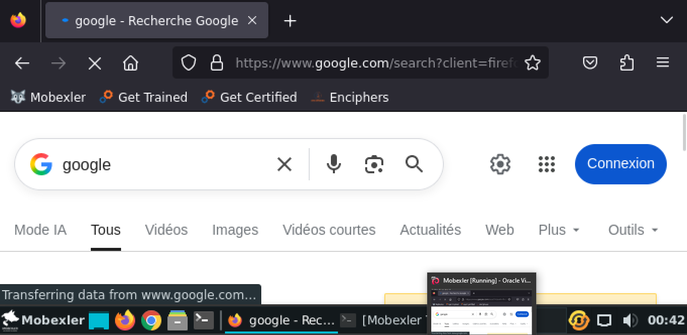

---

## 10. Vérification d’ADB

ADB a été vérifié avec la commande :

```bash
adb version
```

Résultat observé :

```text
Android Debug Bridge version 1.0.39
```

Cela confirme que l’outil ADB est disponible dans l’environnement Mobexler.

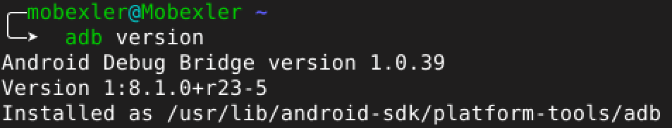

La commande suivante a ensuite été exécutée :

```bash
adb devices
```

Aucun appareil Android n’était encore connecté, ce qui est normal à cette étape du laboratoire.

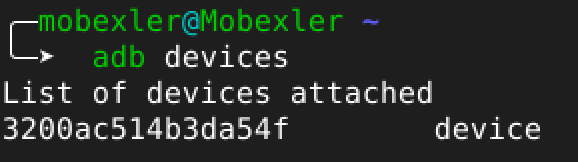

---

## 11. Création du snapshot CLEAN

Après validation de la configuration réseau, de l’accès Internet et de la disponibilité d’ADB, un snapshot propre a été créé.

Nom du snapshot :

```text
CLEAN_BASELINE_TP1
```

Description utilisée :

```text
Import OK, NAT + Host-Only OK, Internet OK, DNS OK, ADB prêt.
```

Ce snapshot permettra de restaurer rapidement la machine virtuelle dans un état propre avant les prochains travaux pratiques.

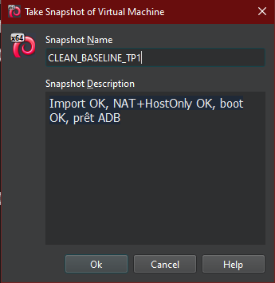

---

## Résumé des validations

| Élément vérifié | Statut |
|---|---|
| Fichier OVA téléchargé | Validé |
| Hash SHA256 calculé | Validé |
| VM importée dans VirtualBox | Validé |
| Adapter 1 configuré en NAT | Validé |
| Adapter 2 configuré en Host-Only | Validé |
| Mobexler démarre correctement | Validé |
| Interface Host-Only avec IP `192.168.56.104/24` | Validé |
| Route réseau vérifiée | Validé |
| Ping vers `8.8.8.8` | Validé |
| Ping vers `google.com` | Validé |
| Internet fonctionnel dans Firefox | Validé |
| ADB disponible | Validé |
| Snapshot `CLEAN_BASELINE_TP1` créé | Validé |

---

## Conclusion

L’environnement **Mobexler** est maintenant opérationnel pour les prochains laboratoires de sécurité mobile.

La machine virtuelle dispose d’un accès Internet via **NAT**, d’une interface **Host-Only** pour la communication avec une cible Android de test, et de l’outil **ADB** pour les futures manipulations Android.

Le snapshot **CLEAN_BASELINE_TP1** garantit un état de départ propre et restaurable avant toute expérimentation avancée.
